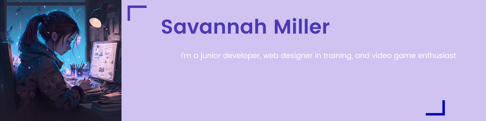

## 👋 Hi, I’m <b>@VisualViolet</b>, but you can call me Savannah!

---  

 

I'm a junior developer who is interested in web development and software development, game development, web design, and cybersecurity. I'm gaining valuable experience from my enrollment in the University of Washington Coding Bootcamp! After I receive my certificate, I plan to use my new skillset to join the software development workforce as a full-stack developer.
Have a new project and want some help? Let me know! I'm looking to collaborate on any project I can contribute to. My number one goal is to learn new skills!
Profile picture was generated with the Midjourney bot. Find out more information here: https://midjourney.gitbook.io/docs/.

📫 <b>Contact Me!</b>

savannah_b_miller@outlook.com | www.linkedin.com/in/savannah-b-miller/ | https://visualviolet.github.io/professional-portfolio/

---

<!---
savannah-dev/savannah-dev is a ✨ special ✨ repository because its `README.md` (this file) appears on your GitHub profile.
You can click the Preview link to take a look at your changes.
--->
